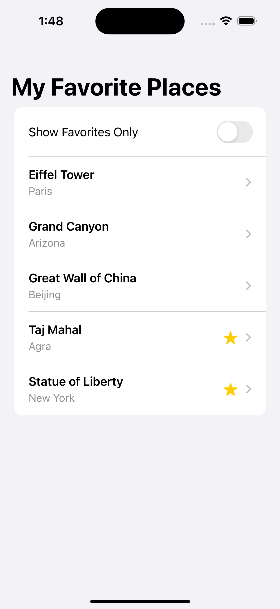
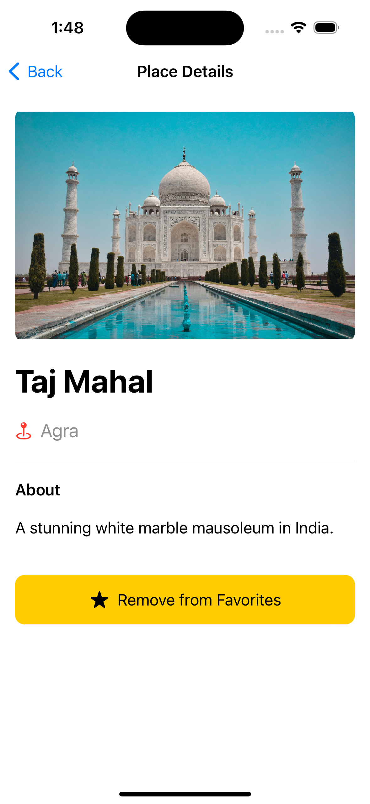

# MyFavouritePlaces

Simple SwiftUI example app that demonstrates a list of favorite places and a detail view.

How to run

1. Open the Xcode workspace or project:

   - Open `Swift/MyFavouritePlaces/MyFavouritePlaces.xcodeproj` in Xcode.

2. Select a target (Simulator or a connected device) and press Run (⌘R).

Notes

- This is an iOS-native SwiftUI app. Use Xcode 14+ and a matching iOS SDK.
- Tests are available under `MyFavouritePlacesTests` and `MyFavouritePlacesUITests`.

Troubleshooting

- If you see build errors about the iOS SDK, update Xcode to the version matching the project's deployment target.
- If an asset is missing, check `MyFavouritePlaces/Assets.xcassets`.

## Screenshots

  

    <h4>Home Screen</h4>
    
  

  

    <h4>Details Screen</h4>
    
  

